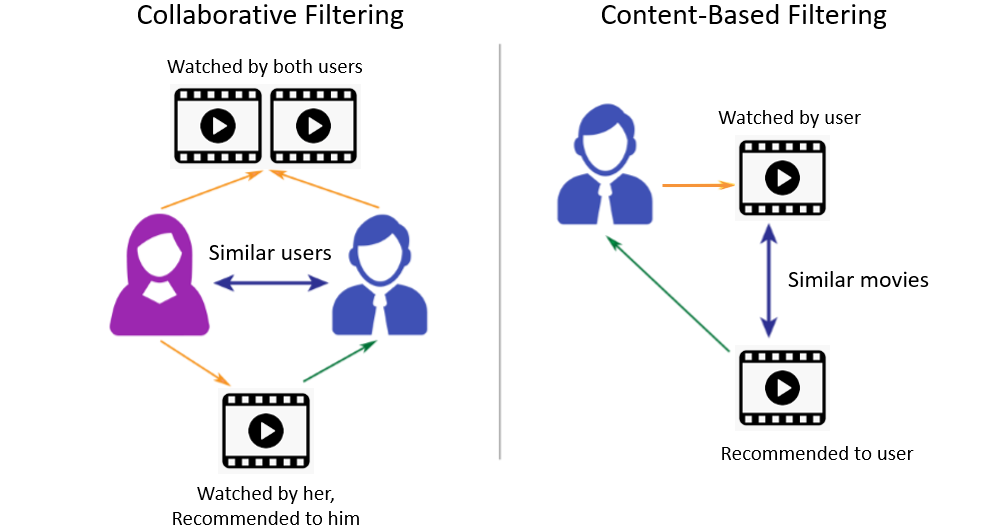

# Methods to modelling recommendation

Sources -   
1. https://towardsdatascience.com/introduction-to-recommender-systems-6c66cf15ada
2. https://visualbi.com/blogs/business-intelligence/data-science/data-science-series-content-based-recommender-system-using-azure-databricks/

## The Entities
There are two entities in a recommender system
1. **Item** - The thing that has to be recommended e.g product, dish, trip, music etc. For simplicity we'll call everything item
2. **User** - The person/event that the recommendation has to be presented to. Again, for simplicity we'll call everything user

## The 2 main methods
There are 2 main methods to creating a recommender system -   

1. **Collaborative filtering based** - the main idea that rules collaborative methods is that these past user-item interactions are sufficient to detect similar users and/or similar items and make predictions based on these estimated proximities. The class of collaborative filtering algorithms is divided into two sub-categories
* **Memory based** - Memory based approaches directly works with values of recorded interactions, assuming no model, and are essentially based on nearest neighbours search (for example, find the closest users from a user of interest and suggest the most popular items among these neighbours). So -
  * Large sparse vectors of past interactions
  * Recommendation done using nearest neighbours

* **Model based** - Model based approaches assume an underlying “generative” model that explains the user-item interactions and try to discover it in order to make new predictions.
  * new representation of users and items are built based on a model (small dense vectors)
  * recommendation are done using the model information

  **Advantages** - It requires no information about users or items. So can be used in many situations   
  **Disadvantages** - Suffers from the cold start problem in situations when you don't have the user item interaction. There are other recommendations that can be show in those situations (most popular items)

2. **Content based method** - Unlike collaborative methods that only rely on the user-item interactions, content based approaches use additional information about users and/or items. If we consider the example of a movies recommender system, this additional information can be, for example, the age, the sex, the job or any other personal information for users as well as the category, the main actors, the duration or other characteristics for the movies (items). The model is built on these available features, trying to explain the observed user-item interactions.

Content based methods suffer far less from the cold start problem than collaborative approaches: new users or items can be described by their characteristics (content) and so relevant suggestions can be done for these new entities.

### Comparing the 2 approaches from perspective of bias and variance

Higher bias occurs when you have a simple model that is not able to learn the pattern in the data. A high variance occurs when you have a model that memorises the data, which a very complicated model can easily do.

* **Memory based collaborative method** - Low bias, high variance. Since there is no inherent model, but just the actual historical user-item interactions, you are memorising the whole data
* **Model based collaborative method** - High bias, low variance.
* **Content based methods** - highest bias. low variance

## Collaborative filtering methods

### Memory based collaborative filtering method
Nearest neighbours based on
* User x User
* Item x Item

Slower

### Model based collaborative filtering method
Involves Matrix factorisation done using -
* SGD (Stochastic Gradient Descent)
* SVD (Singular Value Decomposition)
* Neural network extension

Faster

### Hybrid
Use the model based method to get dense user and item vectors, and then use those to find the nearest neighbours as per memory based approach

## Content based method

* Item centered
* Customer centered
* Combined

## Evaluation metrics
* Regular classification or regression metrics (with some consideration for sampling)
* Human Evaluation
* A/B testing

Packages for building collaborative filtering based recommender systems systems
* Surprise - http://surpriselib.com/
* Fastai -
  * Lesson on collaborative filtering and how to use fastai for that - https://course.fast.ai/videos/?lesson=6
